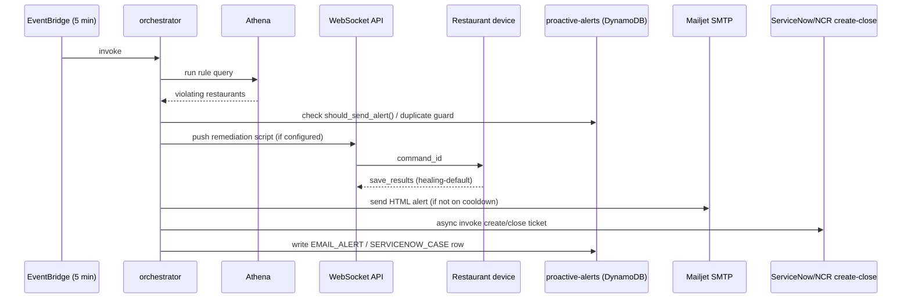

# Group 1 — Snowfall Proactive Alerts & Device Healing

Handles the end-to-end proactive monitoring flow: evaluate rules against Athena, optionally run a remediation script on the restaurant's device over WebSocket, email the ops team, and (see [ServiceNow/NCR Ticketing](02-ServiceNow-NCR-Ticketing.md)) raise/close an NCR ticket. The WebSocket "healing" Lambdas are the plumbing that keeps a persistent connection open between each restaurant's Windows service agent and AWS so scripts can be pushed and results collected.



---

## snowfall-proactive-alerts-orchestrator
**Trigger:** EventBridge schedule, every 5 minutes · **Source:** `core_delta_lake/lambda/scripts/python/snowfall-proactive-alerts-orchestrator/`

This is the main orchestrator and the most important Lambda in the platform. On every run it scans the `incident-rules` DynamoDB table for active rules, executes each rule's Athena SQL query, and for any violating restaurants decides what to do next: trigger a remediation script on the device via the WebSocket API and poll for its result, send an HTML email alert through Mailjet SMTP (subject to per-rule cooldown so the same restaurant isn't re-alerted every 5 minutes), and/or asynchronously invoke the ServiceNow ticket-creation Lambda to raise an NCR case. It also invokes the ticket-close Lambda when a rule stops violating (issue cleared) or once a script has completed successfully in the same run.

Each rule has a `cooldown_type` field (`SOFT` or `HARD`, blank = no cooldown at all) controlling `should_send_alert()`: the very first alert for a rule always sends. After that, **SOFT** waits out `email_cooldown_hours` but bypasses the wait early if a new restaurant starts violating; **HARD** ignores restaurant/result changes entirely and only re-sends once `email_cooldown_hours` has actually elapsed since the last SENT alert — if `email_cooldown_hours` is 0/blank on a HARD rule, it never repeats.

It writes alert/case history to the `proactive-alerts` DynamoDB table using a `record_type` discriminator (`EMAIL_ALERT` vs `SERVICENOW_CASE`) and enforces a duplicate guard so a new ticket is never raised while an existing one is still OPEN for the same rule. Adding a new alert is a config-only change (new DynamoDB rule item) — no redeploy needed. Known rough edges: WebSocket endpoint URLs are hardcoded per-stage in the code instead of being env-driven, and several SNS failure-notification paths depend on `SNS_TOPIC_ARN` being set.

## snowfall-proactive-dynamodb-rules
**Trigger:** Manual / one-off invoke · **Source:** `.../snowfall-proactive-dynamodb-rules/`

A setup/bootstrap utility, not part of the runtime pipeline. It seeds the `incident-rules` DynamoDB table with a configurable number (`NUM_RULES`) of placeholder rule records (`active`, `email_alert`, `servicenow_alert`, `proactive_script` all set true, with dummy query/description/email text) so a new environment has rows to edit rather than creating them by hand in the console.

It's idempotent — it scans existing `rule_id` values first and only creates the ones that don't already exist, so it's safe to re-run. After running it, an engineer must go into DynamoDB and replace the placeholder `query`, `email_dl`, `incident_description` and `proactive_script_name` fields with real values before the rule becomes useful; it does not validate or run any of the SQL itself.

### How to add a new rule by hand

You don't need the bootstrap Lambda above to add a rule — most of the time it's quicker to just create the item directly in the `incident-rules` table (DynamoDB console → table → **Create item** → switch to the JSON view, or `aws dynamodb put-item`). Here's a real one I used to test `SOFT` cooldown behaviour, kept exactly as I ran it:

```json
{
  "rule_id": { "S": "22" },
  "active": { "BOOL": true },
  "cooldown_type": { "S": "SOFT" },
  "created_at": { "S": "2025-12-04T15:27:15.276756+00:00" },
  "email_alert": { "BOOL": true },
  "email_cooldown_hours": { "S": "0" },
  "email_dl": { "S": "venkata.adapa@uk.mcd.com" },
  "incident_description": { "S": "TESTING SOFT cooldown type " },
  "proactive_script": { "BOOL": false },
  "proactive_script_name": { "S": "test.ps1" },
  "query": { "S": "SELECT '04071' as \"restaurant_number\", 'UK04071MS01' as \"device_id\", '[PROACTIVE] Meraki switch UK04071MS01 offline at restaurant 04071 - hardware fault, engineer not required proactive scprit fixed' as \"message\"" },
  "servicenow_alert": { "BOOL": false },
  "servicenow_business_service": { "S": "Restaurant Drive-thru Sales Channel" },
  "servicenow_category": { "S": "Close/Open" },
  "servicenow_priority": { "S": "3" },
  "servicenow_request_type": { "S": "Software" },
  "servicenow_service_offering": { "S": "POS - Drive-thru" },
  "servicenow_subcategory": { "S": "Red M Logo" }
}
```

A couple of things worth explaining about the shape of this, since it trips people up the first time:

- Every value is wrapped in its DynamoDB type descriptor (`"S"` for string, `"BOOL"` for boolean) — that's just what you get from the console's JSON view or `get-item`/`put-item` over the CLI/SDK. If you're editing a rule through the console's normal form view instead, you won't see these wrappers, you just fill in the field and pick the type from a dropdown.
- `rule_id` has to be unique and is a string even though it looks numeric (`"22"`, not `22`) — the table's rules are string-keyed throughout, including `email_cooldown_hours` and `servicenow_priority`, so don't be tempted to switch those to Number types.
- `query` is the Athena SQL the orchestrator runs every 5 minutes for this rule. Whatever columns you alias in the `SELECT` are what the orchestrator has available for the email/ticket text, so it's safer to copy the column aliases from a working rule (`restaurant_number`, `device_id`, `message` here) than to invent new ones. This particular example hardcodes a single fake row rather than querying a real table, which is a handy trick for testing a rule end-to-end without needing a real violation to occur.
- `active: false` is the fastest way to switch a rule off without deleting it — the orchestrator skips it entirely on its next run.
- `email_alert` / `servicenow_alert` / `proactive_script` are independent on/off switches, not a single "severity" setting. This example has `email_alert: true` but `servicenow_alert: false`, so it'll email but never raise an NCR ticket even though all the `servicenow_*` fields are filled in — those are just sitting there ready for whenever someone flips `servicenow_alert` to `true`. Same idea with `proactive_script: false` here — `proactive_script_name` is ignored while that flag is off.
- The `servicenow_service_offering` / `servicenow_category` / `servicenow_subcategory` combination has to match one of NCR's known valid combinations on their end (they validate this as a set, not as independent free-text fields) — check with NCR or an existing working rule before inventing a new combination, otherwise ticket creation will fail with a NCR validation error even though the DynamoDB write succeeds.
- `cooldown_type: "SOFT"` with `email_cooldown_hours: "0"` is a deliberate test setup, not something you'd want in production — a 0-hour cooldown means the wait is satisfied immediately, so this rule would re-email on basically every 5-minute run. It's a good pattern to reuse when you want fast feedback while testing a new rule, just remember to set a sane `email_cooldown_hours` before it goes live.
- New rules take effect on the orchestrator's very next scheduled run (within 5 minutes) — no redeploy, no cache to clear.

## snowfall-proactive-healing-connect
**Trigger:** WebSocket API Gateway `$connect` route · **Source:** `.../snowfall-proactive-healing-connect/`

Handles a restaurant device's WebSocket connection request. It requires the request to have already passed the JWT authorizer (below); it reads `restaurant_number`, `device_id` and `machine` out of the authorizer context (not query params) and writes a new `connected` record to the WebSocket connections DynamoDB table keyed on `restaurant_number`/`device_id`, storing the `connectionId` and a UTC `last_seen` timestamp.

This is intentionally thin — it does not talk to any other system. If a device's connection is rejected, the fix is almost always in the JWT authorizer (bad/expired token, or the machine name isn't in the S3 allow-list) rather than in this function.

## snowfall-proactive-healing-default
**Trigger:** WebSocket API Gateway `$default` route (catch-all for non-connect/disconnect messages) · **Source:** `.../snowfall-proactive-healing-default/`

This is the inbound message handler for everything a restaurant's service agent sends over an established WebSocket connection. It branches on an `action` field in the message body: `register` (upserts the connection record, used when a device re-announces itself), `heartbeat` (keep-alive, updates `last_seen`/`status` and replies `pong`), and `save_results` (the device reports back the stdout/stderr/exit status of a remediation script that was pushed to it, written to the results DynamoDB table keyed by `restaurant_number` + `result_id` = the original `command_id`).

The orchestrator Lambda polls that same results table after triggering a script, so this function is the other half of the request/response loop for remote script execution. The success/failure classification used downstream in the email (`successful` / `unsuccessful` / `error/timeout`) is driven entirely by whether `result_output` contains the literal string `COMPLETED SUCCESSFULLY` — scripts must print that exact marker on success.

## snowfall-proactive-healing-disconnect
**Trigger:** WebSocket API Gateway `$disconnect` route · **Source:** `.../snowfall-proactive-healing-disconnect/`

Fires whenever a device's WebSocket connection drops (network blip, service restart, etc.). It scans the connections table for the row matching the closed `connectionId` (there's no GSI on `connectionId` today, so this is a full table scan — a known scaling concern) and flips its `status` to `disconnected` with an updated `last_seen`, but never deletes the row so connection history is preserved.

There's no retry/backoff logic here and it fails silently (just logs) if no matching record is found, which is expected for connections that never completed a proper `register`/`connect` handshake.

## snowfall-proactive-healing-jwt-authorizer
**Trigger:** WebSocket API Gateway Lambda authorizer, runs before `$connect` · **Source:** `.../snowfall-proactive-healing-jwt-authorizer/`

Gatekeeper for every device WebSocket connection. It expects a `Authorization: Bearer <jwt>` header, fetches the HS256 signing secret from Secrets Manager (`uk-snowfall-service-agent`), and decodes/validates the token. It then cross-checks the token's `machine_name` claim against an allow-list CSV (`server_list/List of Restaurant Servers.csv`) stored in S3 — that CSV is the same file produced by the `service-agent-server-list-extract` Lambda (see [Service Agent group](07-Service-Agent-Integration.md)).

If everything checks out it returns an `Allow` IAM policy along with `restaurant_number`/`device_id`/`machine` in the authorizer context, which the downstream `connect` Lambda reads directly (it does not re-derive these from query params). Any failure — missing header, bad signature, expired token, or machine not on the allow-list — results in a blanket `{"isAuthorized": false}`; there's no detailed error surfaced back to the device, so troubleshooting a rejected device usually means checking CloudWatch logs for this function.

## snowfall-proactive-healing-monitor
**Trigger:** EventBridge schedule · **Source:** `.../snowfall-proactive-healing-monitor/`

A read-only observability job. On each run it computes a staleness threshold from the `STALE_TIMEOUT` env var (currently `30m`; the code also supports plain minutes or an `h` suffix) and scans the connections table for rows that are already `disconnected` or whose `last_seen` is older than that threshold, logging what it finds.

It currently takes no action beyond logging (no alerting, no cleanup/deletion) — it's a foundation for future work such as raising an alert or purging genuinely dead connections, and is a good place to start if the team wants better visibility into flaky restaurant connectivity.

---

## Troubleshooting / Runbook

| Symptom | First things to check |
|---|---|
| A rule is violating but no email/ticket fired | Rule `active` flag in `incident-rules`; Athena query actually returns rows when run manually; `cooldown_type`/`email_cooldown_hours` and whether a prior `SENT` `EMAIL_ALERT` row exists for that rule (HARD cooldown only re-sends after `email_cooldown_hours` has elapsed since that prior alert — a HARD rule with `email_cooldown_hours` at 0/blank never repeats, check this first if the rule uses HARD) |
| Device never receives a pushed remediation script | Connections table row for that `restaurant_number`/`device_id` shows `status = connected`; CloudWatch logs on `snowfall-proactive-healing-jwt-authorizer` for auth rejections; the orchestrator's WebSocket endpoint URL is hardcoded per stage in code — confirm it matches the stage actually deployed |
| "Why didn't we get an SNS alert for this failure" | Confirm `SNS_TOPIC_ARN` is set on the Lambda in question — several failure paths across this group silently no-op without it |
| Same restaurant/rule keeps re-alerting every 5 minutes | Cooldown is not being reached because `cooldown_type` is blank on the rule — blank means cooldown checks are skipped entirely (backward-compat default), not that a default cooldown applies |
| Duplicate NCR tickets for the same rule | Check for a stale `SERVICENOW_CASE` row stuck non-CLOSED in `proactive-alerts` — the duplicate guard blocks new tickets only while a case is OPEN, so a case that never got marked CLOSED will silently suppress all future tickets for that rule, not create duplicates (verify which failure mode is actually happening before assuming duplicates are the issue) |
| New alert rule not taking effect | Config-only change (new row in `incident-rules`) — no redeploy needed; double-check the rule item's field names against an existing working rule, there is no schema validation on write — see "How to add a new rule by hand" above for a worked example |
| Device WebSocket keeps reconnecting/dropping | Check `snowfall-proactive-healing-disconnect` logs — no retry/backoff exists there by design; frequent disconnects are usually a network/service-agent issue on the restaurant side, not this Lambda |

---
*Back to [the index](00-Handover-Index.md) for the full inventory, glossary and known gaps.*
