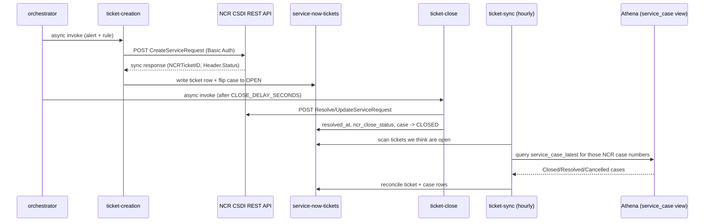

# Group 2 — ServiceNow / NCR Ticketing

These four Lambdas implement the "raise a real support ticket" half of the proactive alerts flow. NCR Voyix operates McDonald's UK's ServiceNow-based service desk, and integration is over a REST-over-HTTPS API (despite the legacy tech doc calling it SOAP) secured with HTTP Basic Auth, credentials in Secrets Manager (`uk-snowfall-ncr-servicenow`). None of these Lambdas run on a simple schedule against "all tickets" — creation/close are invoked on-demand by the orchestrator, and sync runs hourly to reconcile state.

---

## servicenow-proactive-ticket-creation
**AWS name:** `uk-snowfall-servicenow-proactive-ticket-<env>` · **Trigger:** Asynchronously invoked by `snowfall-proactive-alerts-orchestrator` · **Source:** `core_delta_lake/lambda/scripts/python/servicenow-proactive-ticket-creation/`

Creates a single NCR ServiceNow ticket for one proactive alert via NCR's `CreateServiceRequest` REST endpoint. It's invoked async (fire-and-forget from the orchestrator's point of view) with the rule/restaurant/violation details, builds the NCR JSON payload (`Site.SiteNumber` zero-padded to 4 digits, `Category`/`Subcategory`/`ServiceOffering` mapped from the rule's `servicenow_*` fields, restaurant/device details embedded in free-text Summary/Description since NCR has no device-level field), and POSTs it with Basic Auth.

The full ticket record (NCR ticket ID, status, etc.) comes back **synchronously** in the create response — NCR's REST API returns HTTP 200 even for business-logic failures, so success must be checked via `Header.Status`/`Fault.FaultCode` in the body, not the HTTP status code. On success it writes a row to the `service-now-tickets` DynamoDB table and updates the matching `SERVICENOW_CASE` row in `proactive-alerts` so the orchestrator's duplicate guard can see there's now an OPEN case for that rule.

## servicenow-proactive-ticket-close
**AWS name:** `uk-snowfall-servicenow-proactive-ticket-close-<env>` · **Trigger:** Asynchronously invoked by the orchestrator · **Source:** `.../servicenow-proactive-ticket-close/`

The counterpart to ticket creation: resolves an already-open NCR ticket via NCR's `ResolveServiceRequest`/update endpoint when the orchestrator decides the underlying issue is resolved — either because a remediation script completed successfully in the same run, or because a later run's Athena query no longer returns a violation for that rule/restaurant. The orchestrator deliberately waits ~15 seconds (`CLOSE_DELAY_SECONDS`) after creating a ticket before ever calling close, to give NCR time to register the new ticket first.

It writes `resolved_at`, `ncr_close_status` and `close_notes` back onto the ticket row in `service-now-tickets`, and flips the corresponding `SERVICENOW_CASE` row in `proactive-alerts` to `CLOSED` — this is what allows a future violation of the same rule to raise a brand-new ticket instead of being blocked by the duplicate guard. Note the resolution notes text is stored on the **ticket** row, not the case row — a common point of confusion when checking DynamoDB by hand.

## servicenow-proactive-ticket-sync
**AWS name:** `uk-snowfall-servicenow-proactive-ticket-sync-<env>` · **Trigger:** EventBridge, hourly at `:45` past the hour, business hours only (`cron(45 6-20 ? * MON-FRI *)`) · **Source:** `.../servicenow-proactive-ticket-sync/`

A reconciliation job that catches tickets closed *on the NCR side* (e.g. by an NCR field engineer) that our create/close Lambdas never heard about. It scans `service-now-tickets` for tickets we still consider open, batches their NCR case numbers (100 per batch) and queries the Athena view `uk_snowfall_semantic.ncr_service_now_service_case_latest` (populated by an AppFlow ServiceNow connector) for any that NCR now shows as `Closed`/`Resolved`/`Cancelled`. It's scheduled 15 minutes after the upstream NCR AppFlow ingest lands so the Athena view is fresh.

For every closed case found it updates the ticket row (`closed_at`, `ncr_state`, `close_notes`, `resolution_code`) and — for engineer-raised tickets with no script involved — also flips the matching `SERVICENOW_CASE` row to `CLOSED`. **Important environment caveat:** NCR intentionally stopped feeding the DEV `service_case` Athena view (last updated Jan 2026); this Lambda only has live data to reconcile against in PROD, so DEV testing needs a cross-account read or seeded data (see `Localfiles` NCR ingest notes for details).

## servicenow-tickets-cleanup
**Trigger:** Manual invoke only (DEV utility, not scheduled) · **Source:** `.../servicenow-tickets-cleanup/`

A bulk-delete utility for wiping test data out of the `service-now-tickets` and/or `proactive-alerts` DynamoDB tables during DEV/CERT testing — **it should never be pointed at PROD tables**. Invoked with an optional JSON payload (`target`: `tickets`/`alerts`/`all`, plus optional `prefix`/`status`/`record_type` filters, a `dry_run` flag, and a `max_delete` cap defaulting to 10,000 rows per table).

It scans each target table, applies the filter, and deletes matching rows in batches, logging progress every 25 deletes; running with `dry_run: true` first returns a sample of the first 5 matched keys without deleting anything, which is the recommended way to sanity-check a filter before actually clearing data.

---

## Troubleshooting / Runbook

| Symptom | First things to check |
|---|---|
| Ticket create "succeeded" (HTTP 200) but no ticket in NCR | NCR returns HTTP 200 even for business-logic failures — check `Header.Status`/`Fault.FaultCode`/`Fault.FaultDescription` in the response body, not the status code; `FaultDescription` names the exact missing/invalid field |
| Ticket never closes even though the issue is resolved | Check the `SERVICENOW_CASE` row actually has `ncr_ticket_id` populated, and that `CLOSE_DELAY_SECONDS` has elapsed since creation (NCR needs time to register the new ticket before it will accept a close) |
| DEV testing shows no tickets ever reconciling as closed | Expected — NCR stopped feeding the DEV `service_case` Athena view (Jan 2026); `servicenow-proactive-ticket-sync` only has live data in PROD. Use a cross-account read or seeded data for DEV testing |
| Need to check ticket close notes and don't see them | Close/resolution notes live on the **ticket** row (`close_notes`) in `service-now-tickets`, not the `SERVICENOW_CASE` row in `proactive-alerts` — a frequent point of confusion |
| Need to wipe test data | Use `servicenow-tickets-cleanup` with `dry_run: true` first — **never** point it at PROD tables; there is no environment guard in the code itself, only convention |
| Basic Auth / 401 errors from NCR | Confirm the `uk-snowfall-ncr-servicenow` secret's URL/username/password keys match what the environment (CERT vs PROD) expects — CERT and PROD use different credentials and endpoint URLs |

---
*This is the group I'd expect most support tickets to come from — worth reading closely. Index: [00-Handover-Index.md](00-Handover-Index.md).*
