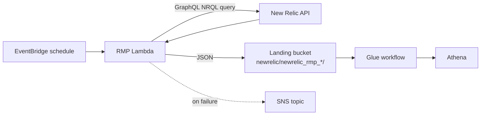

# Group 3 — New Relic RMP Monitoring

"RMP" (Restaurant Management Platform, i.e. the in-restaurant servers/back-office PCs) monitoring. All five Lambdas share the same pattern: fetch an API key + New Relic account ID from Secrets Manager (`uk-snowfall` secret, key `uk-snowfall-newrelic-account-id-rmp`), run one or more NRQL queries against New Relic's GraphQL API, lightly reshape the results, and drop a timestamped JSON file into the landing S3 bucket for the Glue pipeline to pick up. On any failure they publish to the shared SNS failure topic.

---

## newrelic-rmp-device-metrics
**Trigger:** EventBridge, every 10 minutes (`var.newrelic_10min_schedule`) · **Source:** `core_delta_lake/lambda/scripts/python/newrelic-rmp-device-metrics/`

Pulls per-device performance/utilisation metrics (disk, CPU etc. — this is the dataset the proactive-alerts "disk space 90%" rule queries against downstream in Athena) from New Relic and lands them under `newrelic/newrelic_rmp_device_metrics/` in the landing bucket. It derives `restaurant_number` and a short `device` code by regex-parsing the hostname (digits found in a specific substring of the hostname, e.g. `UK04071GSC01` → restaurant `04071`), which is why hostname naming convention changes on the New Relic side can silently break restaurant attribution.

This is the most operationally important of the five RMP Lambdas since it directly feeds the proactive alerting rules that open NCR tickets — if this Lambda stops running, "disk space" style proactive tickets stop being raised even though nothing else in the chain looks broken.

## newrelic-rmp-fetch-device
**Trigger:** EventBridge, hourly (`var.newrelic_1am_schedule`) · **Source:** `.../newrelic-rmp-fetch-device/`

Fetches device/OS inventory info (instance type, kernel version, Linux distro, Windows family/platform/version) per hostname and writes it to `newrelic/newrelic_rmp_device_info/`. This is inventory/metadata rather than a live metric — it's used for reporting on what OS/hardware estate is out in restaurants, not for alerting.

Unlike the metrics Lambda it does no restaurant-number extraction itself; downstream Glue/Athena processing is expected to join this against other datasets (e.g. the server list) if restaurant attribution is needed.

## newrelic-rmp-network-info
**Trigger:** EventBridge, every 10 minutes · **Source:** `.../newrelic-rmp-network-info/`

Collects per-interface network telemetry (MAC address, interface name, IPv4/IPv6, and average receive/transmit bytes/packets/errors/drops per second) per hostname and writes it to `newrelic/newrelic_rmp_network_info/`. This is the finer-grained, frequent-interval sibling of the daily aggregate below — useful for near-real-time network health dashboards/alerts rather than trend reporting.

Code-wise it's almost identical to the daily-aggregate Lambda (same NRQL shape, same field list) — if you're changing one, check whether the other needs the same fix, since they were clearly copy-pasted from a common base.

## newrelic-rmp-network-info-daily-aggregate
**Trigger:** EventBridge, daily at 1 AM UTC (`var.newrelic_1am_schedule`) · **Source:** `.../newrelic-rmp-network-info-daily-aggregate/`

Same network metric shape as `newrelic-rmp-network-info` above but queries a daily-aggregated NRQL window and writes to a separate prefix (`newrelic/newrelic_rmp_network_info_daily_aggregate/`). Exists to give Glue/Athena a cheaper, pre-aggregated daily rollup for trend reports/dashboards without having to aggregate the high-frequency raw data every time.

Because the two network Lambdas are near-duplicates, a reasonable future refactor would be to parameterise a single function with the aggregation window rather than maintaining two copies — flagging this for whoever inherits the codebase.

## newrelic-rmp-process-info
**Trigger:** EventBridge, every 10 minutes · **Source:** `.../newrelic-rmp-process-info/`

Queries New Relic for running-process information per host and writes it to `newrelic/newrelic_rmp_process_info/`. Used for visibility into what's running on restaurant back-office machines (e.g. detecting unexpected or missing critical processes) rather than for alerting directly.

Follows the exact same `get_secret` → `new_relic_query` → `save_to_bucket` → SNS-on-failure pattern as its siblings in this group; if you need to add a new RMP dataset, this file (or `newrelic-rmp-device-metrics`) is the best template to copy.

---

## Troubleshooting / Runbook

| Symptom | First things to check |
|---|---|
| Proactive "disk space" style NCR tickets stop appearing | Check `newrelic-rmp-device-metrics` is actually running (CloudWatch logs/metrics) — it directly feeds the Athena data proactive-alert rules query; other RMP Lambdas failing won't affect ticketing |
| A restaurant's data is missing/misattributed | `restaurant_number` is regex-parsed from the New Relic hostname (e.g. `UK04071GSC01` → `04071`) — a hostname naming convention change on the New Relic side silently breaks this with no error raised |
| One network-info Lambda has a bug the other doesn't | `newrelic-rmp-network-info` and `-network-info-daily-aggregate` are near-duplicates (copy-pasted) — check whether the same fix is needed in both |
| New Relic API key rotated / auth errors | Key lives in the shared `uk-snowfall` secret under `uk-snowfall-newrelic-account-id-rmp` — rotating it affects all five Lambdas in this group simultaneously |

---
*[Back to the index](00-Handover-Index.md).*
