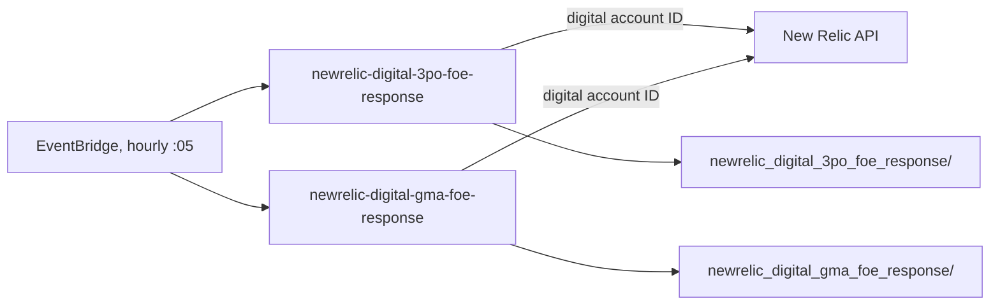

# Group 4 — New Relic Digital FOE Response

"FOE" = Front Of Establishment / front-of-house digital estate (kiosk, digital menu boards, etc. — the "3PO" and "GMA" naming refers to different New Relic digital monitoring accounts/products McDonald's uses). Both Lambdas use a **separate** New Relic account ID (`uk-snowfall-newrelic-account-id-digital`) to the RMP ones in Group 3, even though they share the same `uk-snowfall` secret and API key.

---

## newrelic-digital-3po-foe-response
**Trigger:** EventBridge, hourly at 5 minutes past the hour (`var.newrelic_5min_schedule`) · **Source:** `core_delta_lake/lambda/scripts/python/newrelic-digital-3po-foe-response/`

Queries New Relic's digital/synthetic monitoring for the "3PO" front-of-house response dataset (response-time/availability style metrics for the digital ordering estate) and lands the raw JSON under `newrelic/newrelic_digital_3po_foe_response/` in the landing bucket for the Glue pipeline. It uses the digital account ID rather than the RMP one, and sends its own dedicated SNS failure notification (`NEWRELIC-DIGITAL-3PO-FOE-RESPONSE LAMBDA`) so failures are distinguishable from the RMP jobs in the shared SNS topic.

Structurally it's a near-copy of the RMP fetchers (same `get_secret`/`new_relic_query`/`save_to_s3` shape) just pointed at a different account and NRQL query, so it's a good template if a third "FOE" data source needs onboarding.

## newrelic-digital-gma-foe-response
**Trigger:** EventBridge, hourly at 5 minutes past the hour (`var.newrelic_5min_schedule`) · **Source:** `.../newrelic-digital-gma-foe-response/`

Sibling of the 3PO Lambda above but for the "GMA" digital product/account — same purpose (front-of-house response metrics), same digital New Relic account ID, writing to its own prefix `newrelic/newrelic_digital_gma_foe_response/`.

Because 3PO and GMA are near-identical implementations, treat any bug fix or NRQL change in one as a candidate to check/apply in the other — they were clearly built from the same base and have drifted only in naming/prefix, not core logic.

---

## Troubleshooting / Runbook

| Symptom | First things to check |
|---|---|
| No digital FOE data landing | Confirm the digital account ID (`uk-snowfall-newrelic-account-id-digital`) is correct — it's a different account than the RMP Lambdas in Group 3, so RMP working fine doesn't mean digital's credentials are valid |
| Only one of 3PO/GMA reporting data | They're separate NRQL queries against separate New Relic products — one being down does not imply the other is; check each one's dedicated SNS failure subject line to tell them apart |
| Fix applied to one Lambda but bug persists | Check if the sibling Lambda has the same copy-pasted code path — these two were built from a common base and have drifted only in naming/prefix |

---
*[Back to the index](00-Handover-Index.md).*
