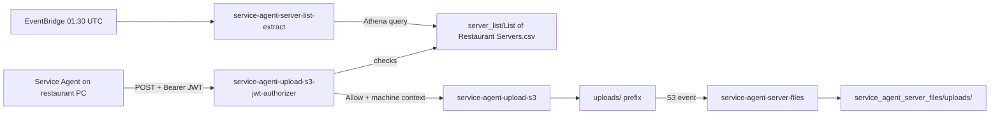

# Group 6 — Service Agent Integration

The "Service Agent" is a Windows service that runs on restaurant back-office PCs/servers. It uploads diagnostic files (XML/CSV) over a REST API and also maintains the persistent WebSocket connection covered in [Group 1](01-Snowfall-Proactive-Alerts-and-Device-Healing.md). These four Lambdas are the REST/API-Gateway side of that integration plus the supporting server allow-list.

---

## service-agent-server-files
**AWS name:** `uk-snowfall-service-agent-server-files-copy-<env>` · **Trigger:** S3 event notification on the raw/landing bucket under `uploads/` · **Source:** `core_delta_lake/lambda/scripts/python/service-agent-server-files/`

Copies files the service agent has uploaded from the `uploads/` prefix into a stable `service_agent_server_files/uploads/` prefix in the target bucket, preserving the relative path. It also supports an on-demand "verify" invocation mode (`{"verify": true, "prefix": "...", "copy_missing": true}`) that diffs the source and target prefixes and can backfill anything missing — handy for a support engineer who suspects a batch of uploads never made it through the normal S3-event path.

Every copy failure triggers an SNS notification naming the specific Lambda and file, so this is one of the easier jobs to triage from alert emails alone. It deliberately skips S3 "folder placeholder" keys (objects ending in `/`).

## service-agent-server-list-extract
**Trigger:** EventBridge, daily at 01:30 UTC · **Source:** `.../service-agent-server-list-extract/`

Runs an Athena query (via `ATHENA_DATABASE`/`WORKGROUP_NAME`) to produce the canonical list of restaurant servers, then copies the resulting CSV from Athena's temp query-results location to a fixed, well-known key: `server_list/List of Restaurant Servers.csv`. It cleans up the Athena temp result files afterwards so they don't accumulate.

This CSV is the allow-list consumed by **both** JWT authorizers in this project family — `snowfall-proactive-healing-jwt-authorizer` and `service-agent-upload-s3-jwt-authorizer` — to validate that a connecting/uploading machine name is a legitimate restaurant server. If a newly commissioned restaurant server can't connect or upload, the first thing to check is whether it appears in this CSV and whether this job has run since the server was added to the source Athena table.

## service-agent-upload-s3
**AWS name:** `uk-snowfall-service-agent-upload-s3-<env>` · **Trigger:** API Gateway REST POST, protected by the JWT authorizer below · **Source:** `.../service-agent-upload-s3/`

The upload endpoint the service agent calls to push diagnostic files. It reads the authenticated `machine` name out of the authorizer context, validates the `Content-Disposition` header contains a filename, restricts uploads to `.xml`/`.csv` extensions and a matching `Content-Type`, derives a cleaned "folder name" from the filename (stripping numeric IDs and non-alphabetic leading characters) and writes the file into S3 under a machine/folder-scoped key.

Any request missing the authorizer context, filename, or with a disallowed extension/content-type is rejected with a `400` before anything touches S3 — this is a good first place to check when a service agent reports upload failures, since the error body describes exactly which validation failed.

## service-agent-upload-s3-jwt-authorizer
**AWS name:** `uk-snowfall-service-agent-upload-s3-jwt-authorizer-<env>` · **Trigger:** API Gateway Lambda authorizer for the upload endpoint above · **Source:** `.../service-agent-upload-s3-jwt-authorizer/`

Same pattern as the WebSocket healing authorizer: validates the `Bearer` JWT (HS256, secret from `uk-snowfall-service-agent`) and checks the machine name against the same S3 allow-list CSV produced by `service-agent-server-list-extract`. On success it passes an authorizer context through to `service-agent-upload-s3`.

Because this and the WebSocket authorizer are near-duplicate implementations sharing the same secret and allow-list, a credential/secret rotation or allow-list format change needs to be applied to both — they are not a shared module, just parallel copies.

---

## Troubleshooting / Runbook

| Symptom | First things to check |
|---|---|
| A restaurant server can't connect (WebSocket) or upload (REST) | Confirm it appears in `server_list/List of Restaurant Servers.csv` and that `service-agent-server-list-extract` has run since the server was added to the source Athena table |
| Upload rejected with 400 | Check the error body — `service-agent-upload-s3` rejects before touching S3 for missing authorizer context, missing filename, or disallowed extension/content-type, and says exactly which |
| A batch of uploads never landed in the target prefix | Invoke `service-agent-server-files` in verify mode (`{"verify": true, "prefix": "...", "copy_missing": true}`) to diff source/target and backfill |
| Auth/allow-list changes needed | Both JWT authorizers (this group's and `snowfall-proactive-healing-jwt-authorizer` in Group 1) share the same secret and CSV — update both, they are parallel copies not a shared module |

---
*[Back to the index](00-Handover-Index.md).*
