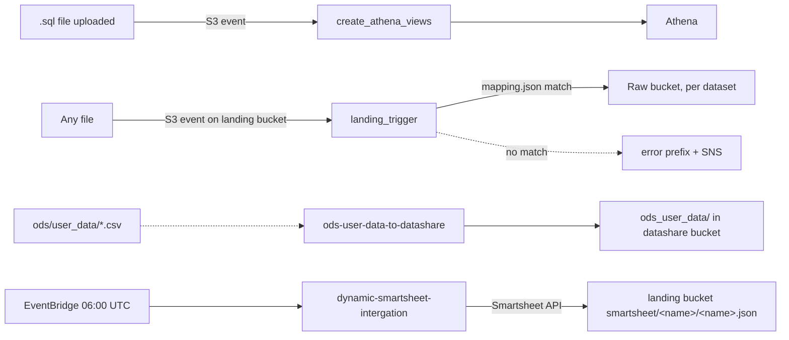

# Group 7 — Core Data Platform Utilities

Foundational, dataset-agnostic plumbing for the ingestion layer: routing newly-landed files to the right raw-bucket location, building Athena views, and two dataset-specific feeds (ODS user data, Smartsheet) that didn't fit neatly into any of the other groups.

---

## create_athena_views
**AWS name:** `uk-snowfall-create-athena-views-<env>` · **Trigger:** S3 event notification (object-created) on a bucket/prefix containing view-definition SQL files · **Source:** `core_delta_lake/lambda/scripts/python/create_athena_views/`

Whenever a `.sql` file is uploaded to its watched S3 prefix, this Lambda reads the file's contents as the view's `CREATE VIEW` (or similar DDL) statement, derives the view name from the filename, and executes it against Athena using the configured workgroup/database, polling `get_query_execution` until it succeeds, fails, or hits a 50-second timeout. Multiple files can arrive in one S3 event batch (`event['Records']`); it processes all of them and only raises at the end if any failed, with a per-view error collected into the response.

This is the mechanism by which new/changed Athena views get deployed — engineers manage view SQL as files (checked into the Glue resources / semantic layer scripts) and dropping/updating the file in S3 is what triggers this Lambda, rather than any human running DDL by hand in the Athena console.

## landing_trigger
**AWS name:** `uk-snowfall-landing-trigger-<env>` · **Trigger:** S3 event notification on the Snowfall landing bucket · **Source:** `.../landing_trigger/`

The central dispatcher for the whole ingestion pipeline: every file uploaded to the landing bucket (from AppFlow, scheduled Lambdas, or manual drops) fires this Lambda, which loads `mapping.json` (a table of `fileName` substring → `destinationPath`), matches the uploaded key against it, and routes the file into the correct raw-bucket destination. Two special-cased routes exist in the code (`base_moving` for the generic case, `amazon_connect` for that specific dataset) via a small `snowfall_sources` helper package.

On success the source file is deleted from the landing bucket; on any exception the file is instead copied to an `error/` prefix in the target bucket (preserved for investigation) and an SNS alert is sent before the original exception is re-raised. If a key doesn't match any entry in `mapping.json` the Lambda deliberately raises `"The object {key} is not recognised"` — so onboarding any new dataset into landing requires adding an entry to `mapping.json` here, or files for that dataset will bounce to `error/` forever.

## ods-user-data-to-datashare
**AWS name:** `uk-snowfall-ods-user-data-to-datashare-<env>` · **Trigger:** S3 event notification (currently commented out in Terraform — confirm live wiring before relying on it) · **Source:** `.../ods-user-data-to-datashare/`

A narrow, single-purpose mover: for any CSV landing under the `ods/user_data` prefix, it clears out the corresponding `ods_user_data` prefix in the datashare/target bucket, copies the new file across, then deletes the source. Its SNS failure subject line ("File Transfer Failure - Sopra to NCR") indicates this feeds ODS (Sopra) user data onward to NCR via the datashare distribution layer.

Note the `aws_s3_bucket_notification` resource wiring this Lambda to its trigger appears commented out in `core_delta_lake/lambda/main.tf` at the time of writing — verify in the AWS console whether this is actually receiving live S3 events or needs to be re-enabled/invoked another way before assuming it's part of the active pipeline. **This is a deliberate open item, not yet fixed** — re-enabling the trigger changes live S3 event wiring and should go through its own review/PR rather than being flipped on as a documentation side-effect.

## dynamic-smartsheet-intergation
**AWS name:** `uk-snowfall-dynamic-smartsheet-intergation-<env>` (note: "intergation" typo is baked into the resource/function name — keep it when referencing this Lambda) · **Trigger:** EventBridge, daily at 06:00 UTC · **Source:** `.../dynamic-smartsheet-intergation/` (previously missing from this checkout; **restored and verified 2026-09-21**)

Fetches two hard-coded Smartsheet sheet IDs (`sheet_ids` list in the source — onboarding a third sheet is a code change, not config) using an API key from the shared `uk-snowfall` Secrets Manager secret (key `uk-snowfall-smartsheet-api-key`), transforms each sheet's rows into a flat list of `{column_name: value}` dicts, and writes one JSON file per sheet to the landing bucket at `smartsheet/<sanitised-sheet-name>/<sanitised-sheet-name>.json` (name is sanitised to be S3-safe: non-alphanumeric characters replaced with `-`). From there `landing_trigger` and the Glue `uk-snowfall-smartsheet` workflow pick it up for processing into the semantic layer.

Its own `notify_failure()` is a lightweight `print()`-only stub (not a real SNS notifier, unlike most other Lambdas in this repo) — a failure here will show up in CloudWatch logs but will **not** page anyone via SNS; if silent failures of this job become a problem, wiring it up to the shared SNS topic like its siblings is a quick win.

---

## Troubleshooting / Runbook

| Symptom | First things to check |
|---|---|
| New dataset lands in error/ prefix forever | `landing_trigger`'s `mapping.json` has no entry for that filename pattern — add one; this is the only way to onboard a new dataset into the landing routing |
| Athena view not appearing/updating | Confirm the `.sql` file actually landed in `create_athena_views`'s watched S3 prefix, and check `get_query_execution` status in its logs (50s poll timeout) |
| ods-user-data-to-datashare doesn't seem to run on new files | Its S3 trigger is commented out in Terraform — confirm whether it's invoked another way or genuinely inactive before treating this as a bug; re-enabling is a deliberate infra decision, not a quick fix |
| Smartsheet data missing/stale | Only 2 sheet IDs are hard-coded in source — a new/renamed sheet needs a code change, not a config change; also check CloudWatch logs directly since failures here don't page via SNS |
| Smartsheet job fails silently with no alert | Expected currently — `notify_failure()` here only prints to logs, it doesn't publish to SNS like other Lambdas in this repo |

---
*[Back to the index](00-Handover-Index.md) — the "Known gaps" table there tracks the two fixes made in this group.*
