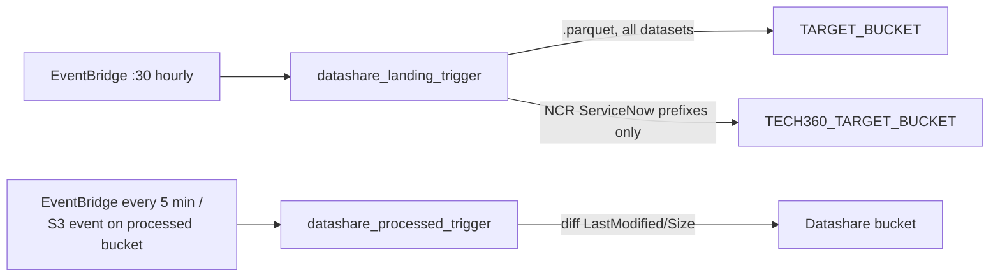

# Group 8 — Datashare Resources

These two Lambdas live in the separate `datashare_resources` Terraform module (not `core_delta_lake`) and implement the "distribution" layer described in the project README: taking processed/raw NCR and other datasets and replicating them out to downstream consumers such as Tech360.

---

## datashare_landing_trigger
**AWS name:** `uk-snowfall-datashare-landing-trigger-<env>` · **Trigger:** EventBridge schedule, runs at 30 minutes past every hour (`cron(30 * * * ? *)`) — despite the name, this is polling on a schedule rather than firing per S3 event · **Source:** `datashare_resources/lambda/scripts/python/datashare_landing_trigger/`

Scans the landing bucket for each prefix listed in its `mapping.json`, and for every real data file found (`.parquet` files are always copied to the general `TARGET_BUCKET`) additionally copies files under a specific set of NCR ServiceNow prefixes (`ncr_service_now/incident/`, `problem_record/`, `service_case/`, `worknotes/`, `incident_sla/`, `account/`, `problem_task/`, `change_request`) to a **second**, Tech360-specific bucket (`TECH360_TARGET_BUCKET`). It does exact-prefix folder matching (guarding against a bug class like `incident_sla` files being wrongly matched under the `incident` prefix) and sends an SNS failure notification naming the specific Lambda function on any error.

This is effectively the "fan-out" point where NCR ServiceNow data (ingested via AppFlow) gets duplicated out to the Tech360 downstream consumer in addition to Snowfall's own processing path — if Tech360 reports missing/stale NCR data, this is the Lambda and its `mapping.json` prefix list to check first.

## datashare_processed_trigger
**AWS name:** `uk-snowfall-datashare-processed-trigger-<env>` · **Trigger:** EventBridge, every 5 minutes (`rate(5 minutes)`) — a companion `aws_s3_bucket_notification`/EventBridge rule in `datashare_resources/eventbridge/main.tf` also reacts to object-create events on the processed bucket, so this is effectively both event-driven and polled as a safety net · **Source:** `.../datashare_processed_trigger/`

A folder-diff sync job: for a fixed list of folders (`ods/`, `meraki/`, and the three New Relic digital/RMP device-info prefixes), it lists objects in both the source (processed) and target (datashare) buckets, compares `LastModified`/`Size` per key, and copies anything new or changed across. It's timeout-aware — it checks `context.get_remaining_time_in_millis()` against a 5-second threshold while paginating and will stop listing early rather than risk a Lambda timeout mid-run, relying on the next 5-minute run to catch up.

Failures per-file are collected into a list and reported as a single summary SNS notification at the end of the run rather than one alert per failed file, which keeps this job from spamming the ops inbox if a whole folder sync has issues. If someone reports "datashare processed bucket is missing recent files", check this Lambda's `FOLDERS_TO_SYNC` list first — a new dataset needs to be added here explicitly or it will never be copied over.

---

## Troubleshooting / Runbook

| Symptom | First things to check |
|---|---|
| Tech360 reports missing/stale NCR data | Check `datashare_landing_trigger`'s `mapping.json` prefix list — only specific NCR ServiceNow prefixes are copied to `TECH360_TARGET_BUCKET`, everything else only reaches the general datashare bucket |
| A dataset never appears in the datashare bucket | `datashare_processed_trigger` only syncs folders explicitly listed in `FOLDERS_TO_SYNC` — a new dataset must be added there, it isn't automatic |
| Sync seems incomplete for large folders | It stops listing early when Lambda remaining time drops below a 5-second threshold, relying on the next 5-minute run to finish — this is by design, not a bug, for very large folders |
| Suspect `incident_sla` files matched under `incident` prefix | `datashare_landing_trigger` does exact-prefix folder matching specifically to avoid this bug class — if it recurs, check for a new prefix that overlaps an existing one as a substring |

---
*[Back to the index](00-Handover-Index.md).*
